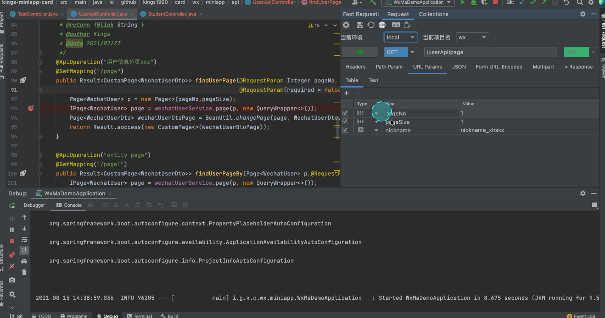
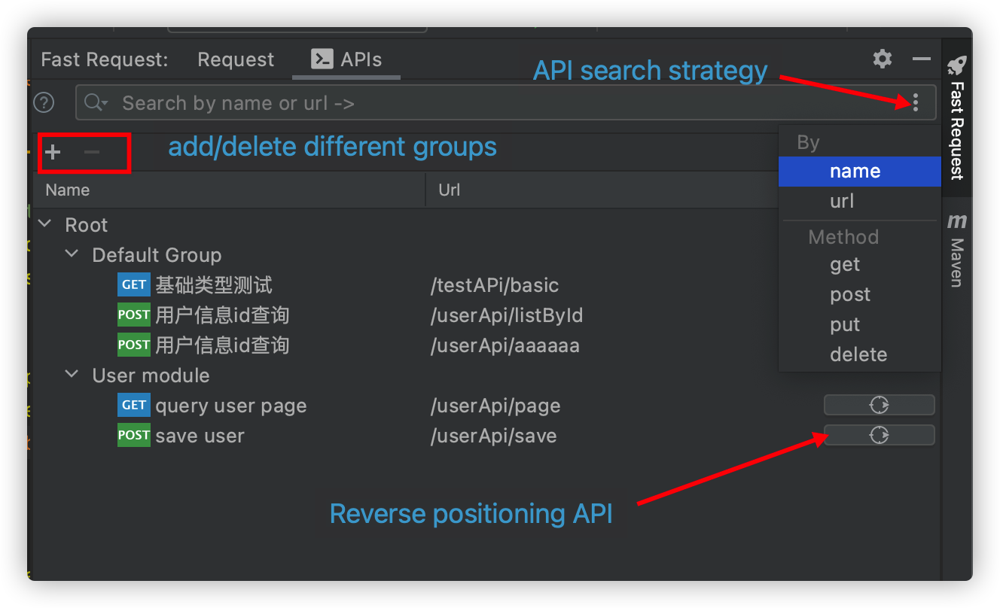
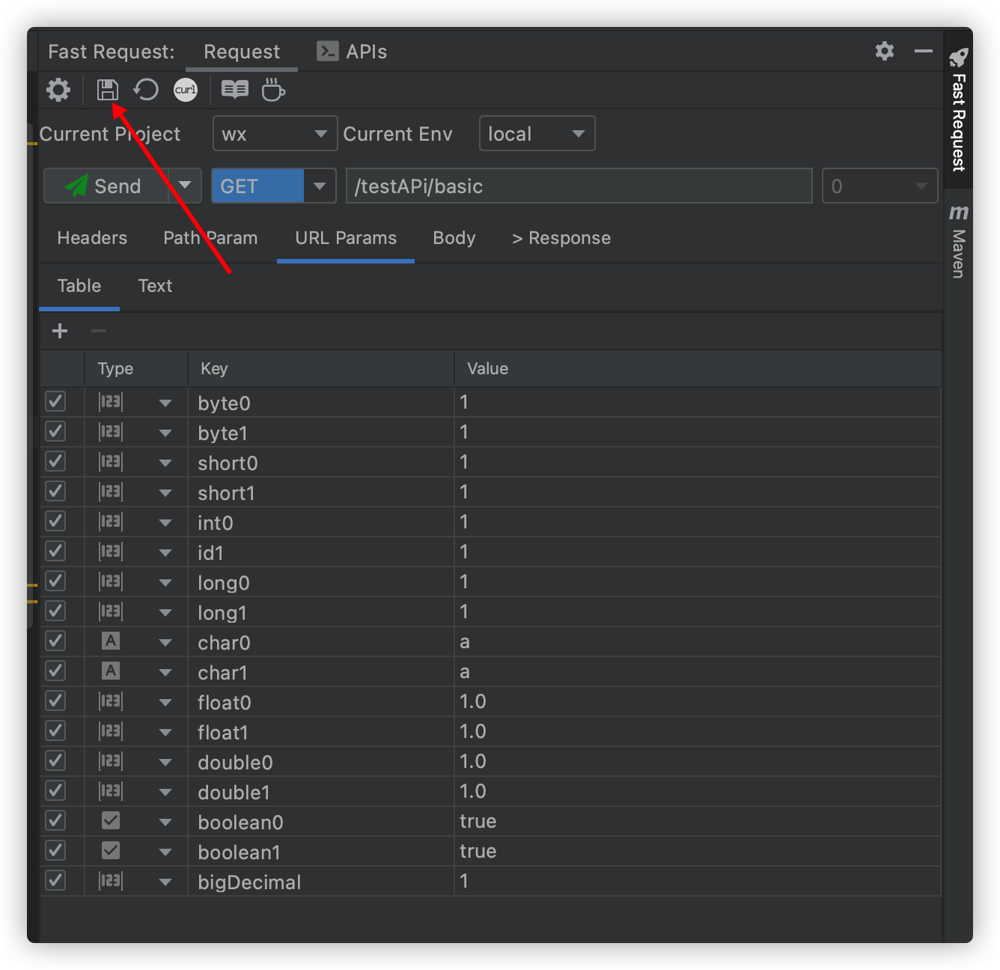
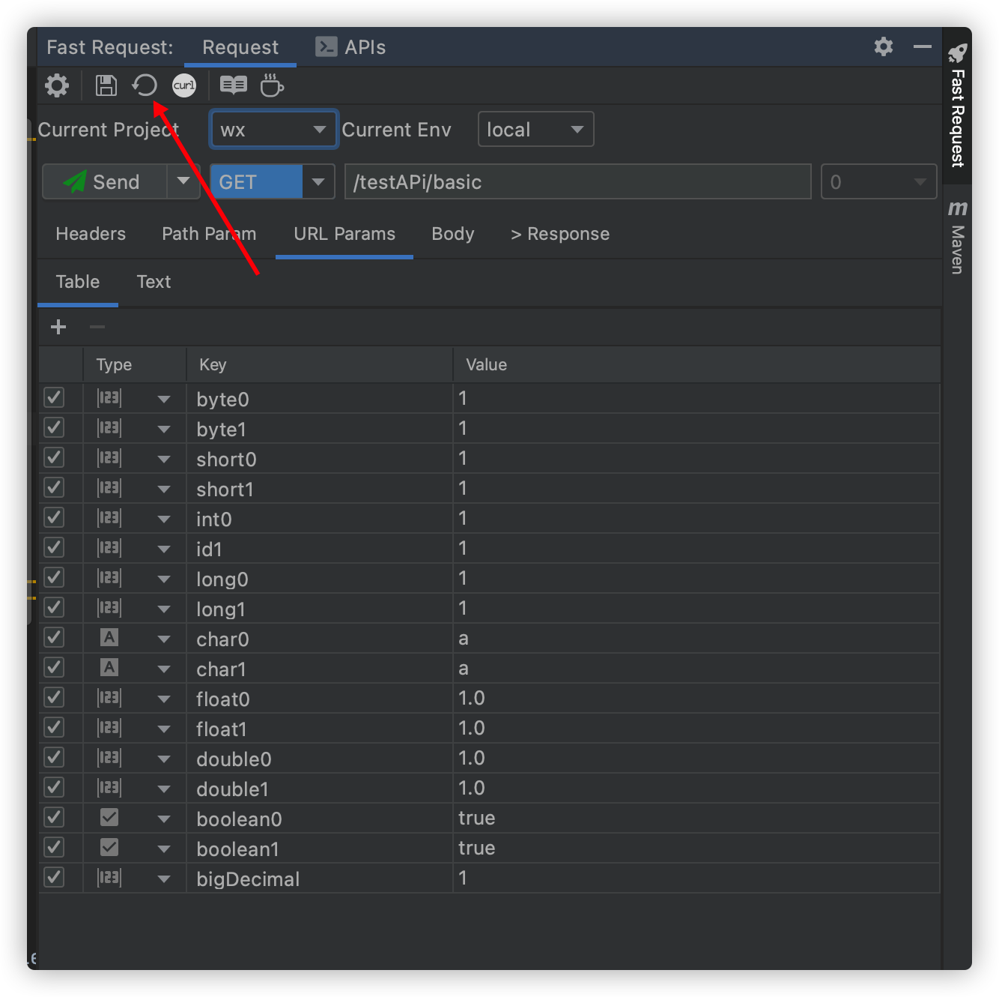
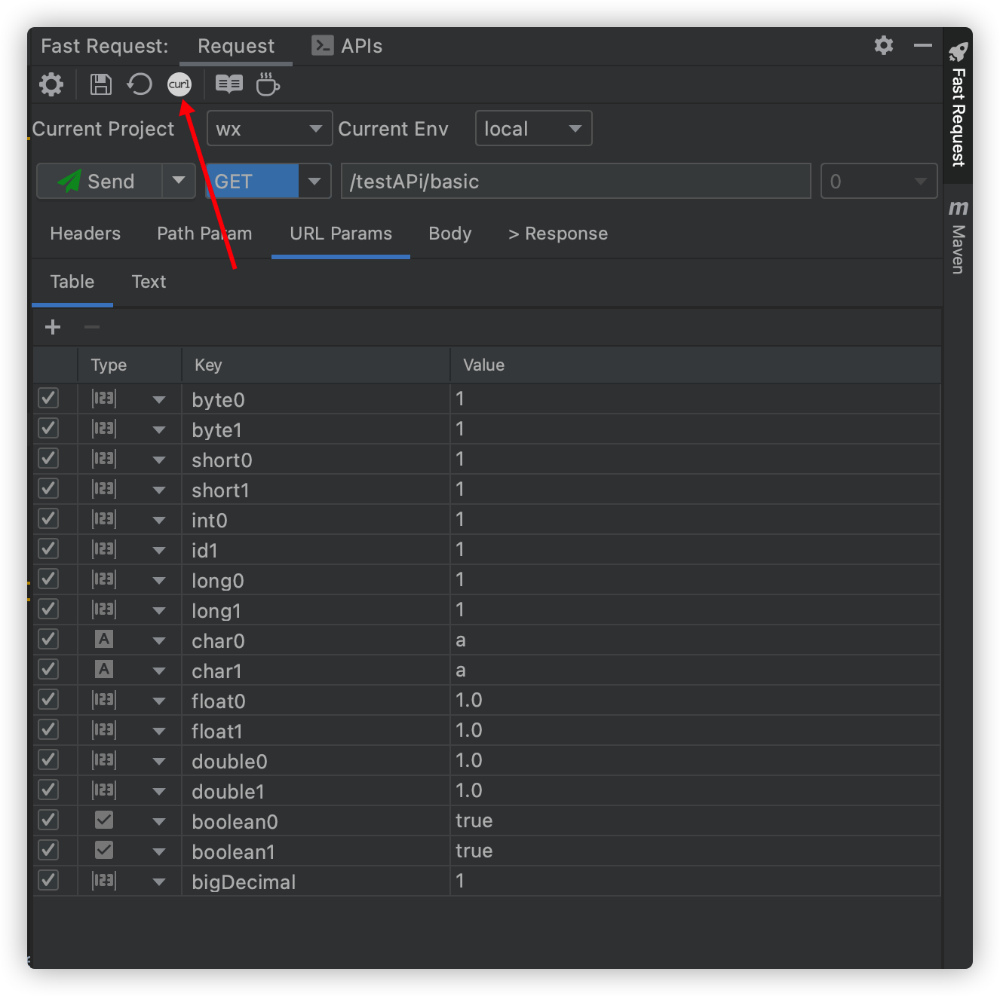

# Features

* generate url and parameters in one click
* Send request to debug API(support to modify the generated parameters)
* Send request and download
* domain customization and switching
* custom parameter parse
* string generation strategy
* save api
* Management API (search filter, modify API name)
* one click location history save api to method
* api to curl

## Debug API & send request

## Send and download

## API List

::: tip API name value calculate:  
1.If the method uses swagger annotation **@io.swagger.annotations.ApiOperation**,Then take the value of the annotation  
2.If there is no swagger annotation,Then take the java Doc description of the method  
3.If two above not matched, return **New Request**  

API name value supports modification  
:::

## Save Request
:::tip Special Note  
The saved request will be put in *Default Group* by default, support drag and drop into other groups  
:::

## regenetate
:::tip Special Note  
If you have saved a request,But if you want to completely re-modify the parameters, then you can choose this operation  
:::

## CURL copy
After generate the method url and parameters, click on the toolbar
