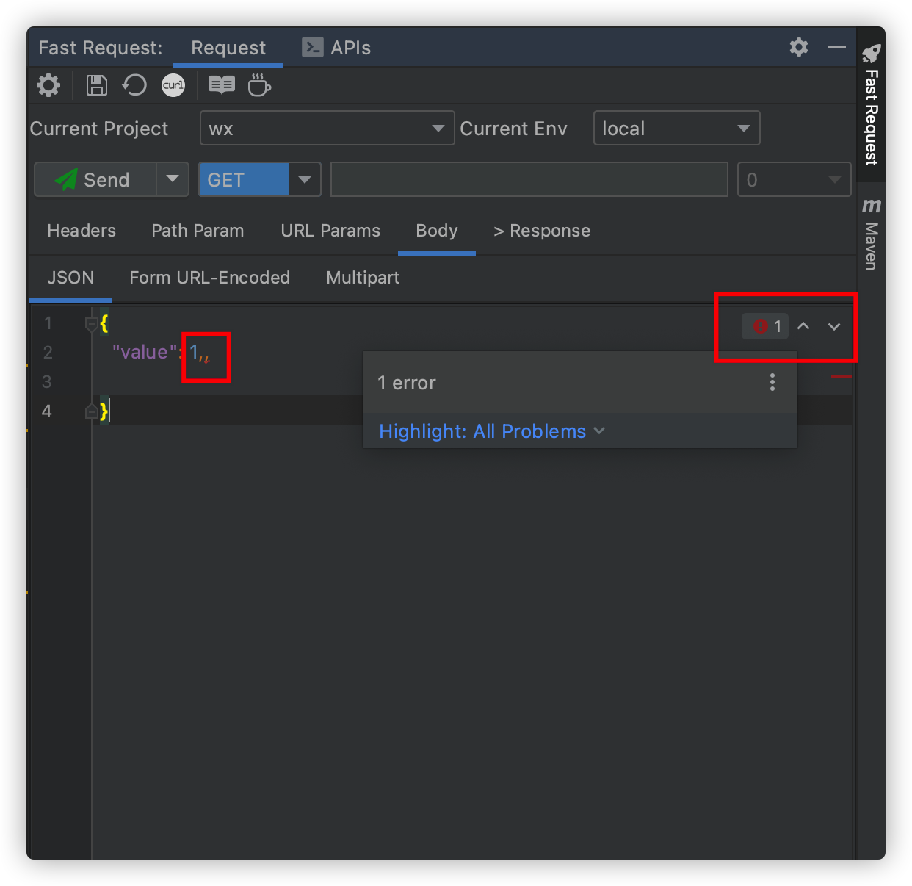
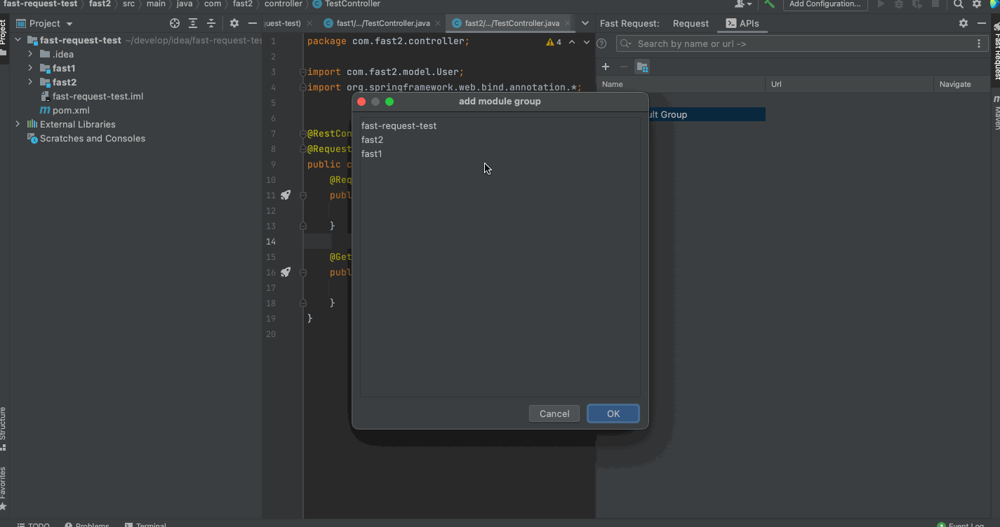
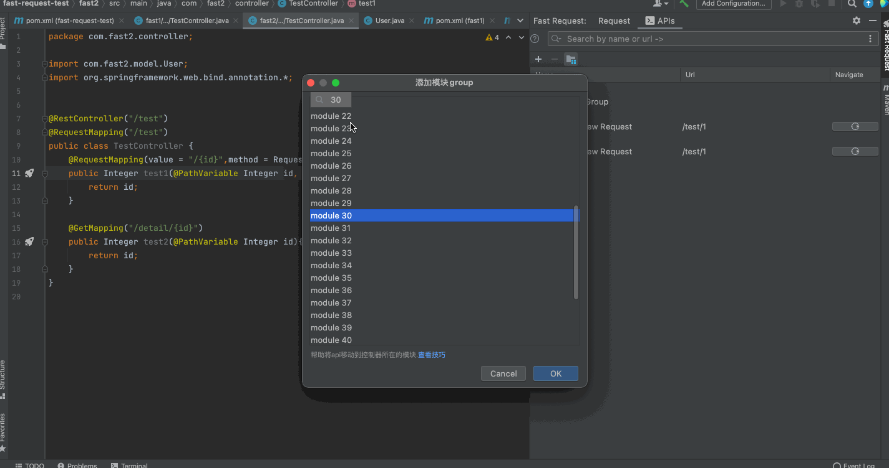
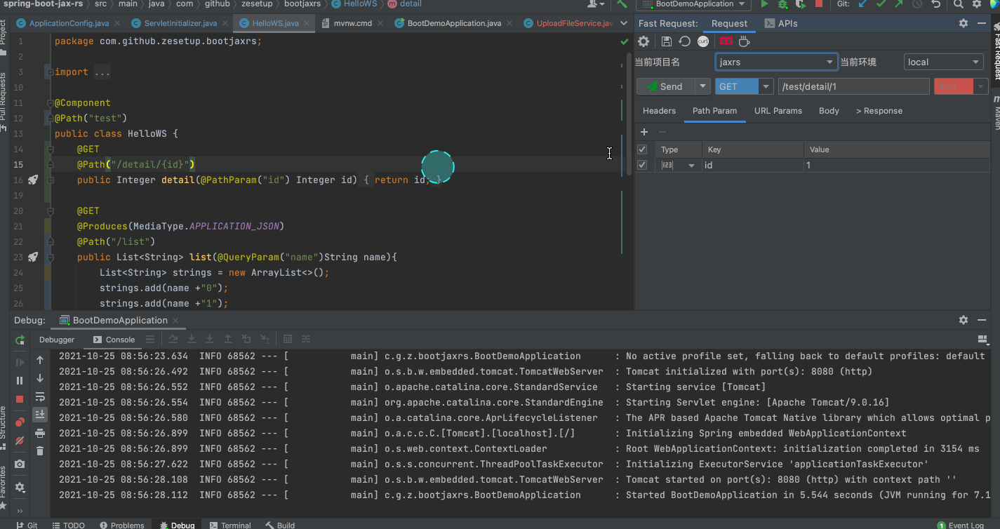
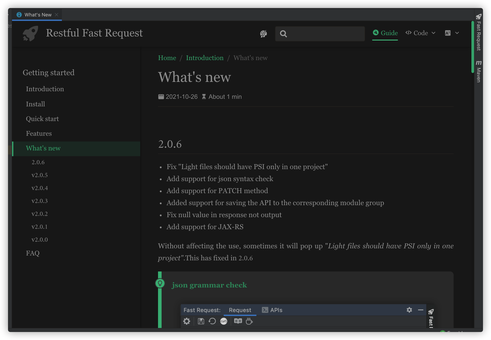

# What's new

## 2.0.6
* Fix "Light files should have PSI only in one project"
* Add support for json syntax check
* Add support for PATCH method
* Added support for saving the API to the corresponding module group
* Fix null value in response not output
* Add support for JAX-RS
* Display what's new

Without affecting the use, sometimes it will pop up "*Light files should have PSI only in one project"*.This has fixed in 2.0.6

::: tip json grammar check

:::

::: tip API group automatic association

Module supports quick search

:::

::: tip JAX-RS support

:::

::: tip Show what's new  
Will only be shown once

:::

## v2.0.5

* JSON built-in editor support
* Fix checkbox hidden when change param by text
* Fix headers param show error when reshow the api
* Optimized the request progress bar display

## v2.0.4

* Fix the interface confusion caused by the response content aisle
* Optimization of response JSON ultra long display
* Optimized icon size
* Migrate Chinese documents to Gitee

## v2.0.3

*   Add confirmation when deleting api
*   Added the support of selecting all parameters and inverting selection
*   Fix param parse for java.util.Set
*   Fix parse like 【@RequestParam
*   Fix the confusion of the quick add header interface

## v2.0.2

*   Fix that the A request is displayed to the B project in the case of multiple open projects
*   Fix array and list param parse error decorate by @ResponseBody
*   Fix List without generic parse error
*   Add support for send and download
*   Show progressbar while sending request
*   Brand new document\[click the doc icon in the toolbar\]
*   Some optimization

## v2.0.1

*   rename from Fast Request to Restful Fast Request
*   merge Json、Form URL-Encoded、Multipart to Body Tab to reduce the tool window width
*   fix bug when modify config in global mode
*   add get、post、delete、put icon to saved request
*   saved request support more search strategy
*   rename tab name from collection to APIs
*   support parse java.time.YearMonth

## v2.0.0

*   support store request
*   support params optional
*   optimal iu
*   fix some bugs