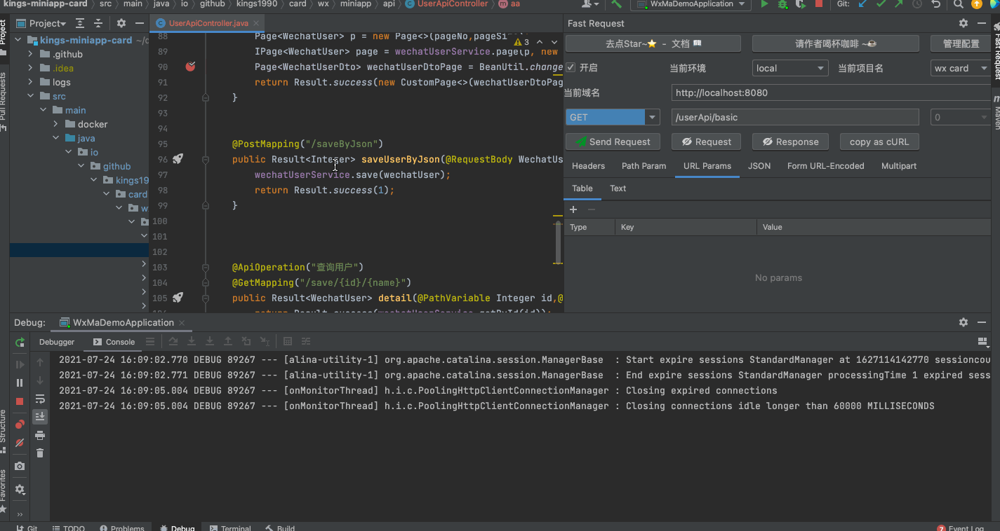
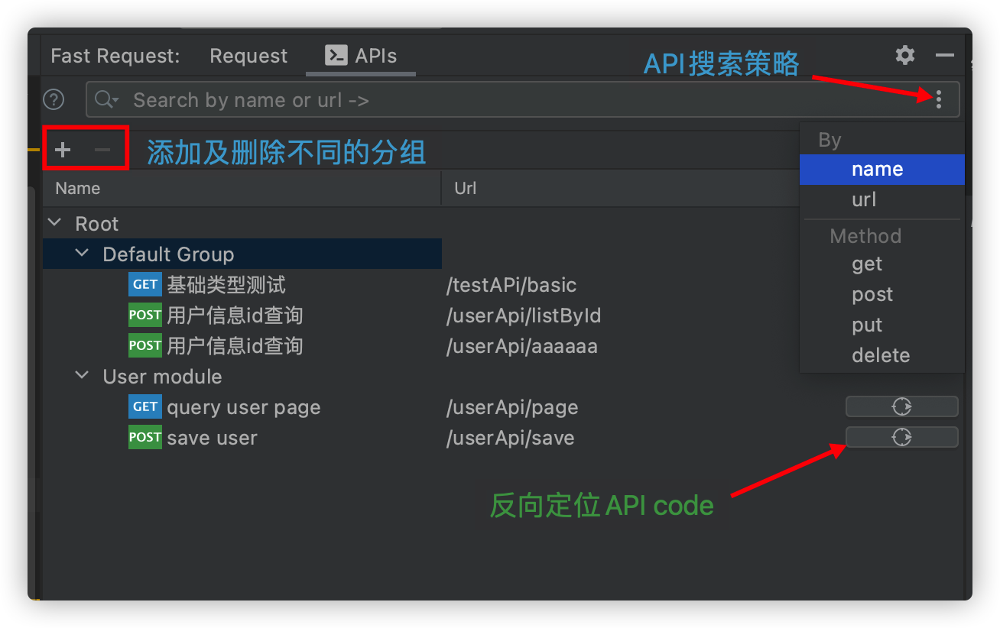
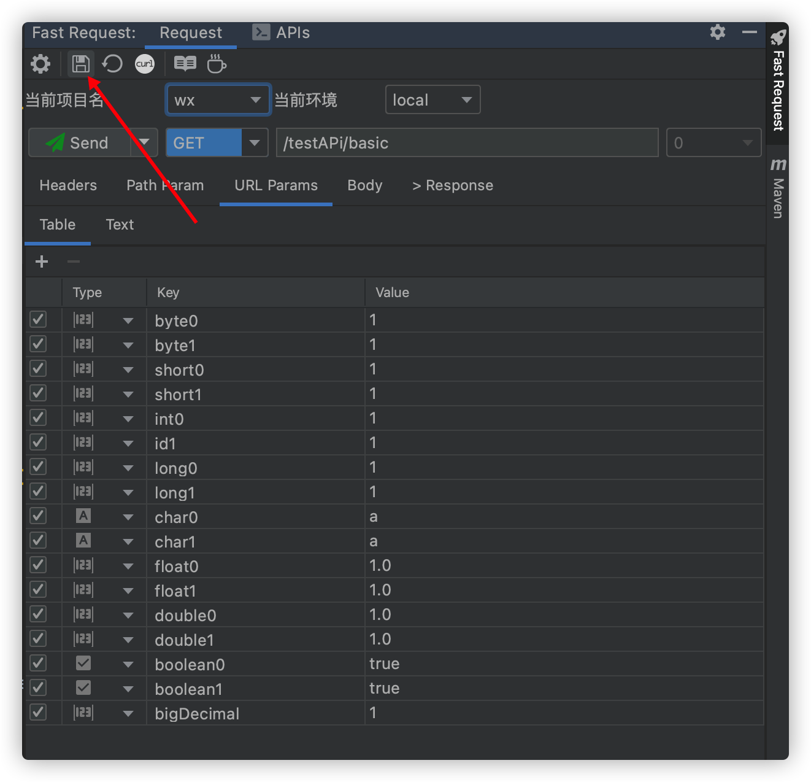
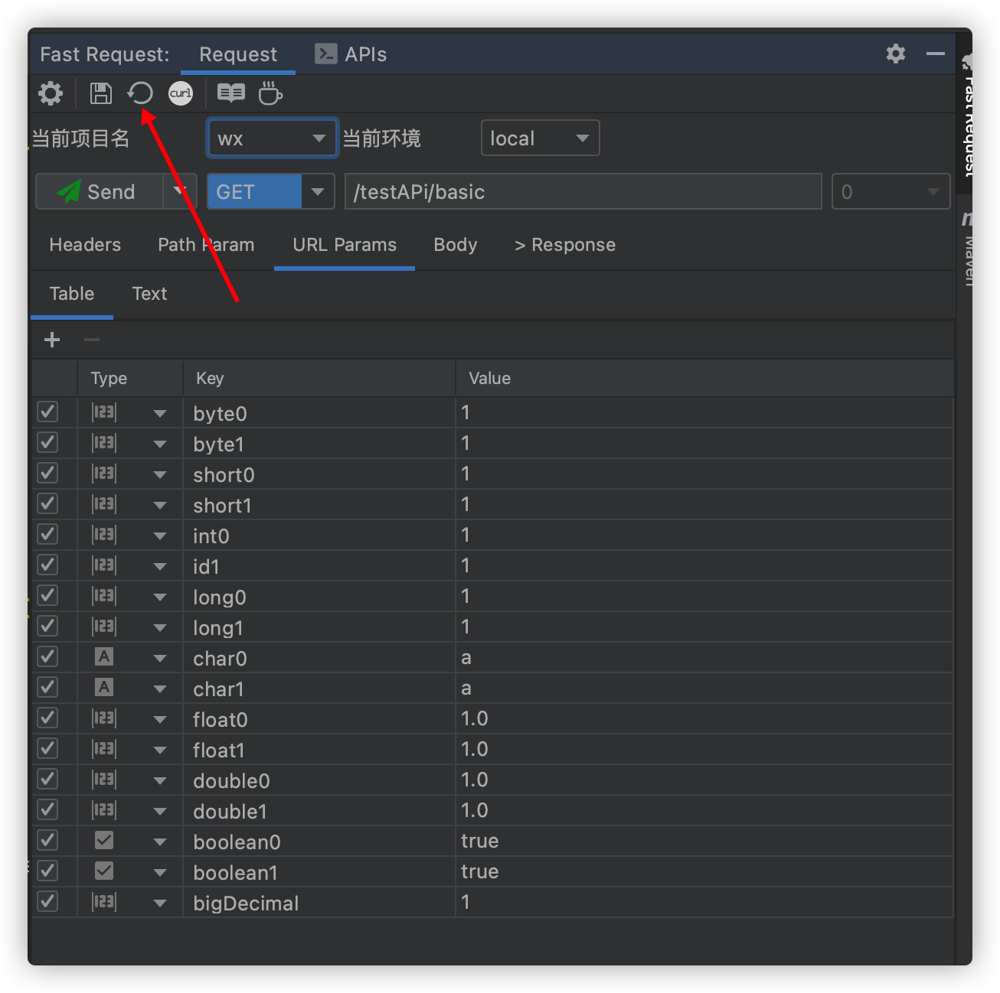
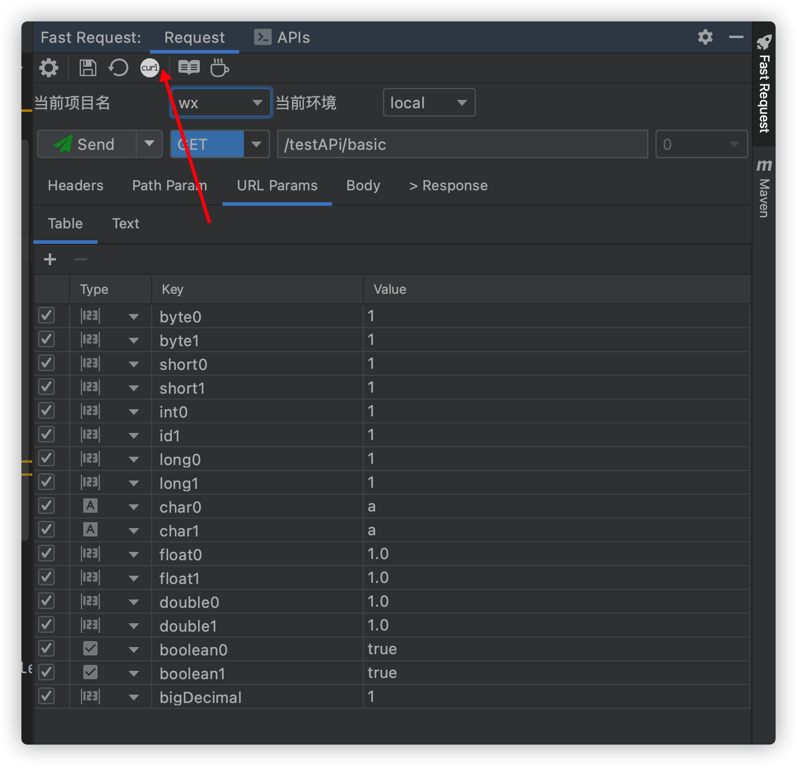
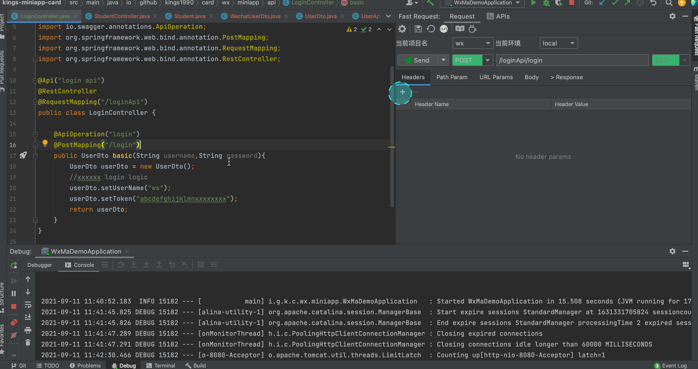
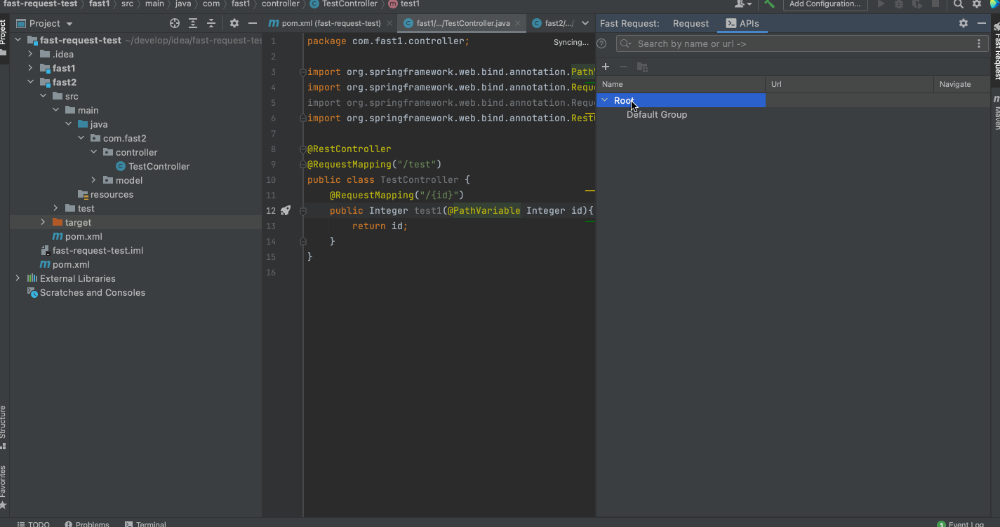
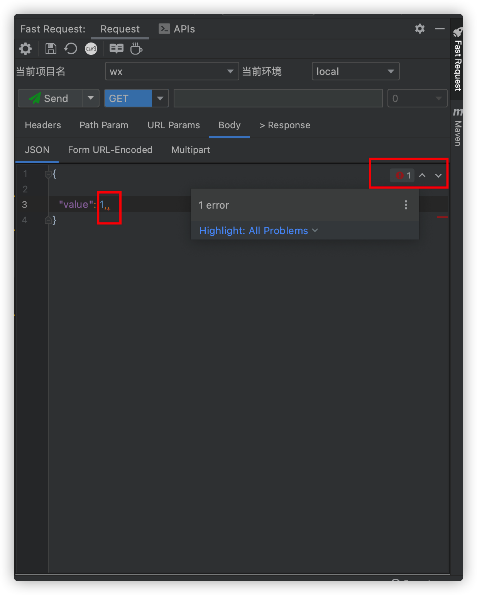

# 功能
* 一键生成url和参数
* 发送请求调试API(支持修改生成的参数)
* 发送请求并下载文件
* 域名定制及切换
* 自定义参数解析
* 字符串生成策略化
* 保存API
* 管理API(搜索过滤、修改API名称)
* 一键定位历史保存的API到方法
* API转curl
* 自动将API关联到模块分组<Badge text="new" />
* 内置Json参数编辑器<Badge text="new" />

## 调试API发送请求<Badge text="2.0.0"/>

## 针对响应是文件的API<Badge text="2.0.2" type="error"/>
点击Send and download

## API列表<Badge text="2.0.1" type="warning"/>

::: tip API列表name取值:
1. 如果方法使用了swagger的@io.swagger.annotations.ApiOperation,则取该注解的value值  
2. 如果没有swagger直接修饰,则取方法的javaDoc描述  
3. 如果意思都没有则返回New Request

API的name值支持修改
:::

## 保存请求<Badge text="2.0.0"/>
:::tip 特别说明
保存的请求默认会放入*Default Group*中,支持拉拽放入别的组
:::

## 重新生存请求<Badge text="2.0.0" type="error"/>
:::tip 特别说明
如果你已经保存一个请求,但是想彻底重新修改其中的参数,那么你可以选择该操作
:::

## CURL 拷贝<Badge text="1.1.4" type="warning"/>
必须是先生存方法url及参数后,点击工具栏

## 快速添加header<Badge text="2.0.0" />
如果你的请求需要一个token而token可以通过一个登陆接口得到,那么你可以不用每次手动添加,只需要访问一下登录接口再通过以下操作来处理

## API分组自动关联<Badge text="2.0.6" type="warning"/>
api分组是为了将保存的api保存到不同分组以便区分不同的api,当处于多模块的项目情况下,支持扫秒项目中的module,并且快速得将module添加到分组中,这种方式会将分组添加到root下

:::tip 特别说明
1. 如果没有创建module分组,那么保存请求的时候会将保存的请求放入Default Group
2. 如果创建module分组,那么保存请求的时候会自动根据当前API所处于的module自动归类到对应的Module Group
3. 当然你可以通过拉拽的方式自行移动API到对应的更小的group,并不冲突  
:::

模块支持快速搜索(光标焦点放在列表上输入关键字即可)

## Json语法检查 <Badge text="2.0.6" type="error"/>
右上角提供了json语法检查,如果输入有误会提示对应的错误  
当然也支持格式化等操作  

