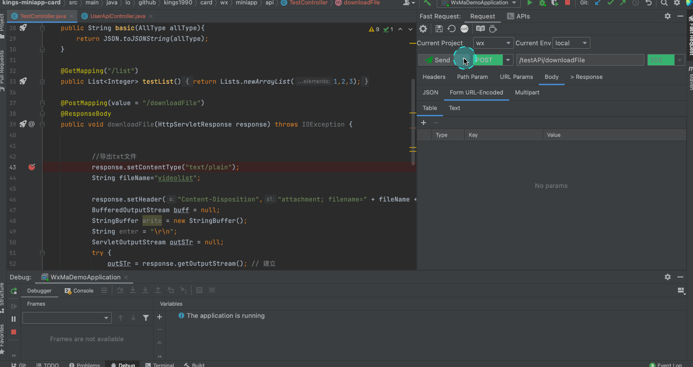
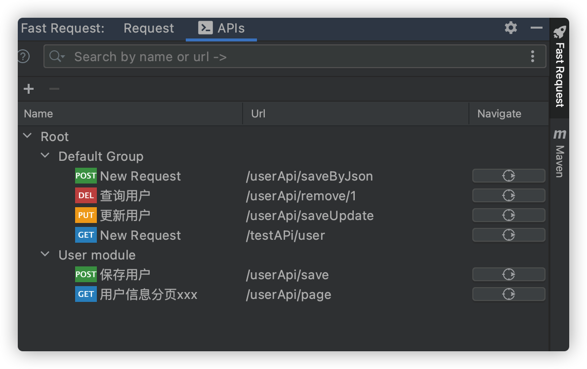

# 功能
* 一键生成url和参数
* 发送请求调试API(支持修改生成的参数)
* 发送请求并下载文件
* 域名定制及切换
* 自定义参数解析
* 字符串生成策略化
* 保存API
* 管理API(搜索过滤、修改API名称)
* 一键定位历史保存的API到方法
* API转curl

## 调试API发送请求

## 针对响应是文件的API
点击Send and download

## API列表

::: tip API列表name取值:
1.如果方法使用了swagger的@io.swagger.annotations.ApiOperation,则取该注解的value值  
2.如果没有swagger直接修饰,则取方法的javaDoc描述  
3.如果意思都没有则返回New Request

API的name值支持修改
:::

## 保存请求
:::tip 特别说明
保存的请求默认会放入*Default Group*中,支持拉拽放入别的组
:::

## 重新生存请求
:::tip 特别说明
如果你已经保存一个请求,但是想彻底重新修改其中的参数,那么你可以选择该操作
:::

## CURL 拷贝
必须是先生存方法url及参数后,点击工具栏

## 快速添加header
如果你的请求需要一个token而token可以通过一个登陆接口得到,那么你可以不用每次手动添加,只需要访问一下登录接口再通过以下操作来处理
